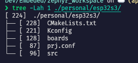

# Create Zephyr WorkSpace 
========================
Install west:
``` Bash

pip3 install -U west

```
Get the Zephyr source code:
``` Bash
west init ~/zephyrproject
cd ~/zephyrproject
west update
```

Change zephyr git version


Current I'm use zephyr version 3.5 stable

https://github.com/zephyrproject-rtos/zephyr/tree/v3.5-branch


---
Export a Zephyr CMake package. This allows CMake to automatically load boilerplate code required for building Zephyr applications.

```Bash
west zephyr-export
```

Zephyr’s scripts/requirements.txt file declares additional Python dependencies. Install them with pip3.
```
pip3 install -r ~/zephyrproject/zephyr/scripts/requirements.txt
```

After, i will see the folder zephyrproject with file  tree as below:


# Create Your Application
========================

``` Bash

cd  ~/zephyproject
mkdir personal

```


Add some file to make it become a basic CMake Project

With me, I create a personal project and create a **addition** folder esp32s3 to make project for **esp32s3**, If you have not more project, can you create a basic project within personal folder



Build

Run this command to build your application

```
cd ~/zephyrproject
west build -b [your board name] ./personal/esp32s3

```

# Document for ESP32-S3

https://docs.espressif.com/projects/esp-idf/en/latest/esp32s3/hw-reference/esp32s3/user-guide-devkitc-1.html